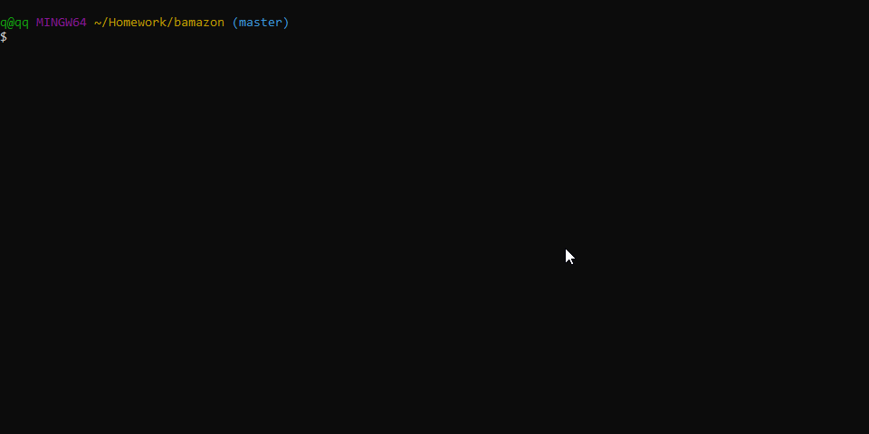

# Bamazon

A Node.js CLI application created during UCF's Web Development Bootcamp. Utilizing a MySQL database the user can "buy" products, check and edit inventory as a manager, and view sales and departments as a supervisor.

## Getting Started

Download or clone the repository [here](https://github.com/onieronaut/bamazon)

### Prerequisites

* [Node.js](https://nodejs.org/en/)
* [MySQL Workbench](https://www.mysql.com/products/workbench/)

### Installation

After downloading the repository and installing Node.js, use your command line interface to navigate to the directory the repository is located in and install the required packages with:

    npm install

### Creating the database

Using MySQL Workbench, copy and paste the contents of [schema.sql](schema.sql) into a query and execute it.

## Usage

There are 3 different applications: they can each be accessed by their respective filenames:

    node bamazonCustomer.js

    node bamazonManager.js

    node bamazonSupervisor.js

Executing each file will prompt the user with navigation choices and input.

### bamazonCustomer.js

This application mimicks how a customer would interact with a shopping website. A list of available items to buy along with their price will be displayed, then a prompt for a user to select which item they'd like to purchase, and how many. If there is not enough stock to make the purchases the user will be notified, upon a successful purchase the inventory is updated in the database and the total price of the purchase is added to the product sales attribute of that item.

### bamazonManager.js

This application mimicks how a manager would interact with their inventory. Upon loading the user is prompted with a menu of choices: View Products, View Low Inventory, Add to Inventory, and Add New Product. After the user has finished navigating through an option, the menu will reappear to prompt the user again.

#### View Products for Sale

Much like the customer application, this displays information about each product, including the stock.

#### View Low Inventory

This function displays all items in the database with an stock of less than 5.

#### Add to Inventory

This function displays all items to the user, along with their stock and then asks to user which item they would like add inventory to and how many units they'd like to add. The stock is then updated in the database.

#### Add New Product

This function asks the user to input the name, department name, price, and starting stock of a new product. This information is then added to the database.

### bamazonSupervisor.js

This application mimicks how a supervisor would look at costs and sales by department. The user is prompted with two menu options: View Sales by Department and Add New Department. After the user has finished navigating through an option, the menu will reappear to prompt the user again.

#### Create New Department

This function asks the user to input the name of a new department along with a value of the overhead cost for that department. This information is then added to the database.

The sales of all items within the same department are condensed into a total value and displayed, along with the overhead costs of that department and a total profit value is calculated from the difference between the two.

## Thoughts

I really enjoyed working on this project. There is something about working on a CLI application that I find satifying. The technology of today seems to be constantly oversensitizing us with flashy effects and high resolution imagery, and something about a simple black and white screen with some text that can interact with some simple data and stll create valuable insights is something I think about often. Node is a lot of fun to work with, I find it very intuitive and the amount of packages I could keep adding to this CLI app to make it look even more clean are limitless. I definitely find myself taking a more simple and clean approach aesthetically when designing projects.

## Built With

* [Javascript](https://www.javascript.com/)
* [Node](https://nodejs.org/en/)
* [MySQL](https://www.mysql.com)
* [Inquirer](https://www.npmjs.com/package/inquirer)
* [NPM MySQL](https://www.npmjs.com/package/mysql)
* [NPM Table](https://www.npmjs.com/package/table)

## Author

* Jerard Gonzalez | [GitHub](https://github.com/onieronaut) [LinkedIn](https://www.linkedin.com/in/jerard-gonzalez-a07467113/) [Portfolio](https://onieronaut.github.io/)
